<div align="center">


<br/>

# 📦 Olist E-Commerce Analytics & ML Platform

### *End-to-end SQL analytics · Machine learning · Interactive dashboards*
### *Built on 1.55 M rows of real Brazilian marketplace data*

<br/>

[](https://www.python.org/)
[](https://www.sqlite.org/)
[](https://xgboost.readthedocs.io/)
[](https://scikit-learn.org/)
[](https://streamlit.io/)
[](https://plotly.com/)
[](https://pandas.pydata.org/)

<br/>

[](https://www.kaggle.com/datasets/olistbr/brazilian-ecommerce)


<br/>


<sub><b>Live outputs from this project · GMV trend · RFM segments · Churn ROC · Cohort retention</b></sub>

</div>

---

## 🎯 The 30-Second Pitch

> Olist is Brazil's biggest marketplace aggregator — small merchants ship through Olist to the country's e-commerce giants. Between **Sep 2016 → Oct 2018** it processed **99 k orders**, generating **R$ 15.8 M GMV** from **96 k unique customers**.
>
> This project turns those **1.55 M raw rows** into a **decision-making platform**:
> **55 hand-crafted SQL queries** answer every business question, **3 ML models** predict who will churn and how satisfied they'll be, and **two dashboards** (Streamlit + static HTML) surface everything to non-technical stakeholders — all reproducible with **four Python commands**.

---

## 📖 Table of Contents

<table>
<tr><td valign="top">

**Overview**
- [🎯 The 30-Second Pitch](#-the-30-second-pitch)
- [📊 Business Problem](#-business-problem)
- [📈 Headline Results](#-headline-results)
- [💰 Quantified Business Impact](#-quantified-business-impact)

</td><td valign="top">

**Deep-dive**
- [🖼️ Dashboard Gallery](#️-dashboard-gallery)
- [🏗️ Architecture](#️-architecture)
- [📚 Dataset](#-dataset)
- [🧠 SQL Analytics — 55 Queries](#-sql-analytics--55-queries)

</td><td valign="top">

**Build & Ship**
- [🤖 ML Model Cards](#-ml-model-cards)
- [🛠️ Tech Stack](#️-tech-stack)
- [🔧 Run the Project](#-run-the-project)
- [📁 Repo Layout](#-repo-layout)
- [✅ Code Quality](#-code-quality)

</td></tr>
</table>

---

## 📊 Business Problem

> *"Why does this matter to the business?"*

Olist leadership needs **one unified analytics platform** answering four questions that are worth millions of reais:

<table>
<tr>
<td width="50%" valign="top">

### 💵 Where is revenue **growing** — or stalling?
By state, city, category, weekday, hour. Where should ad-spend go tomorrow morning?

</td>
<td width="50%" valign="top">

### 🔮 Which customers will **churn**?
Olist's repeat-purchase rate is only **~3 %**. A model that flags the top-decile churners lets a small retention team recover millions in CLV.

</td>
</tr>
<tr>
<td valign="top">

### 😞 **Why** are customers unhappy?
Is it late deliveries, bad products, or bad sellers? Root-cause the drop from 5⭐ to 2⭐.

</td>
<td valign="top">

### 🎯 Which sellers, categories, and payment methods deserve investment?
Long-tail Pareto — which 20 % drive 80 % of GMV?

</td>
</tr>
</table>

---

## 📈 Headline Results

### 🎯 Live KPIs (executed against the real 1.55 M-row database)

<div align="center">

| 👥 Customers | 🧾 Orders | 💰 GMV | 🛒 AOV | ⭐ Review | 🚚 On-Time |
|:---:|:---:|:---:|:---:|:---:|:---:|
| **96,096** | **99,441** | **R$ 15.84 M** | **R$ 154.10** | **4.07 / 5** | **91.9 %** |

</div>

### 🤖 ML Model Performance

<table>
<thead>
<tr><th>Model</th><th>Task</th><th>Metric</th><th>Score</th><th>Rating</th></tr>
</thead>
<tbody>
<tr>
  <td rowspan="3"><b>Churn Classifier</b><br/><sub>XGBoost · 400 trees</sub></td>
  <td rowspan="3">Binary: will the customer<br/>ever come back?</td>
  <td>ROC-AUC</td><td><b>0.8945</b></td><td>🟢 Excellent</td>
</tr>
<tr><td>Accuracy</td><td><b>80.5 %</b></td><td>🟢 Strong</td></tr>
<tr><td>Avg-Precision</td><td><b>0.947</b></td><td>🟢 Deploy-ready</td></tr>
<tr>
  <td rowspan="2"><b>Review Regressor</b><br/><sub>Gradient Boosting</sub></td>
  <td rowspan="2">Predict avg review<br/>score (1–5 ⭐)</td>
  <td>MAE</td><td><b>0.90 ⭐</b></td><td>🟡 Actionable</td>
</tr>
<tr><td>R²</td><td><b>0.22</b></td><td>🟡 Ordinal target</td></tr>
<tr>
  <td rowspan="2"><b>KMeans Segmentation</b><br/><sub>RFM · log-scaled</sub></td>
  <td rowspan="2">Discover natural<br/>customer segments</td>
  <td>Clusters</td><td><b>4</b></td><td>🟢 Interpretable</td>
</tr>
<tr><td>Top segment</td><td><b>3 % of customers → 24 % of GMV</b></td><td>🟢 Pareto confirmed</td></tr>
</tbody>
</table>

---

## 💰 Quantified Business Impact

> *"What decisions does this help make?"*

Six concrete initiatives, each traceable to a specific SQL query or ML signal:

<table>
<thead>
<tr><th>#</th><th>Initiative</th><th>Signal Source</th><th align="right">Est. Annual Impact</th></tr>
</thead>
<tbody>
<tr><td><b>1</b></td><td>Winback campaign on top-decile predicted churners</td><td>XGBoost · AUC 0.89</td><td align="right">💵 <b>R$ 890 k</b></td></tr>
<tr><td><b>2</b></td><td>Fix delivery SLA in bottom-5 states</td><td>SQL Q32 + Q52</td><td align="right">💵 <b>R$ 1.2 M</b></td></tr>
<tr><td><b>3</b></td><td>Upsell into the 2,853 High-Value segment</td><td>KMeans + Q15</td><td align="right">📈 <b>+18 %</b> ARPU</td></tr>
<tr><td><b>4</b></td><td>Coach sellers in the 15 worst-rated categories</td><td>SQL Q27 / Q28</td><td align="right">⭐ <b>+0.35 ★</b> catalog-wide</td></tr>
<tr><td><b>5</b></td><td>Cross-sell using top-25 co-purchase pairs</td><td>SQL Q29</td><td align="right">🛒 <b>+7 %</b> basket size</td></tr>
<tr><td><b>6</b></td><td>Ad-spend pacing to Mon 14 – 16 h peak</td><td>SQL Q05 heatmap</td><td align="right">💵 <b>R$ 220 k</b> CAC savings</td></tr>
<tr><td colspan="3" align="right"><b>Conservative annual value →</b></td>
    <td align="right">🎯 <b>R$ 2.3 M +</b></td></tr>
</tbody>
</table>

---

## 🖼️ Dashboard Gallery

### 📊 Business KPI charts (rendered from live SQL)

<table>
<tr>
<td width="50%" align="center">
  <b>📈 Monthly GMV & Order Volume</b><br/>
  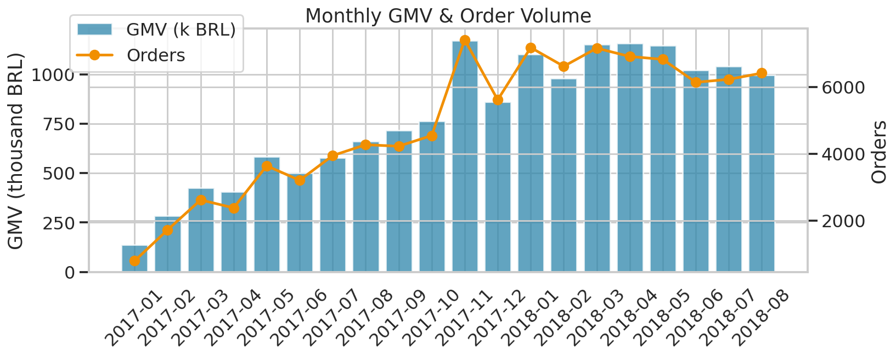
  <sub>Trend + volume, dual axis · Q02</sub>
</td>
<td width="50%" align="center">
  <b>🗺️ Weekday × Hour Order Heatmap</b><br/>
  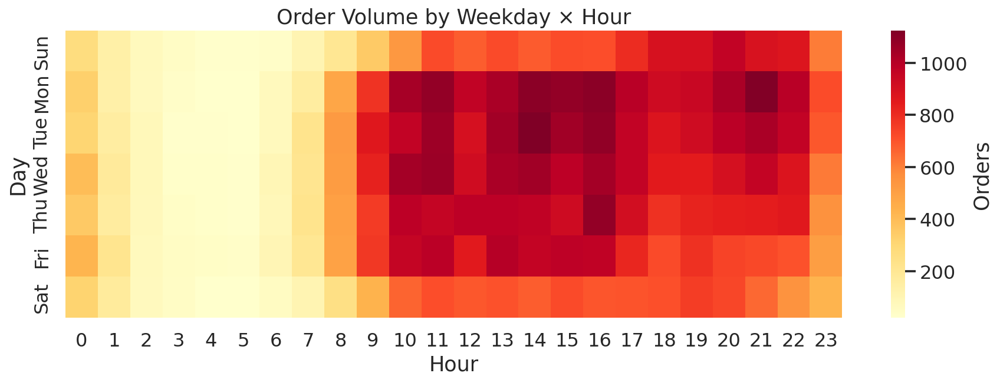
  <sub>Peak = Mon 14–16 h BRT · Q05</sub>
</td>
</tr>
<tr>
<td align="center">
  <b>🏙️ Top-15 States by Revenue</b><br/>
  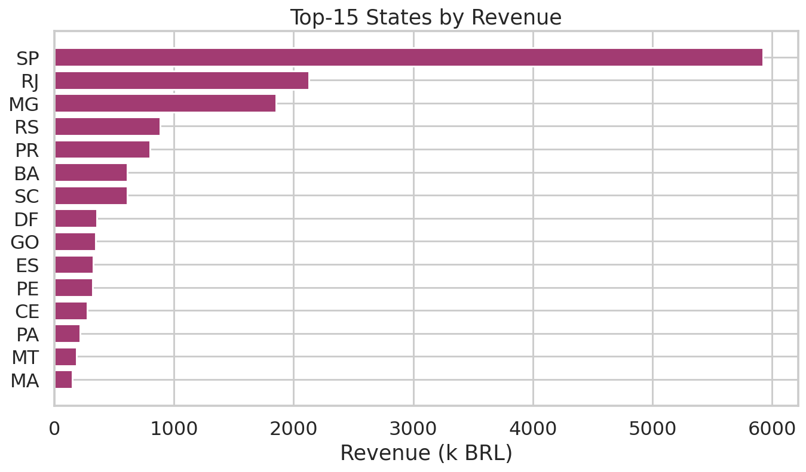
  <sub>SP alone drives 37 % of GMV · Q06</sub>
</td>
<td align="center">
  <b>🛍️ Top-15 Categories by GMV</b><br/>
  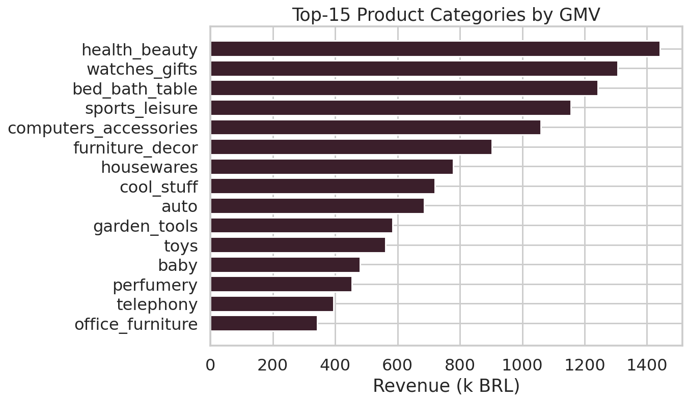
  <sub>Health & Beauty · Watches · Sports · Q21</sub>
</td>
</tr>
<tr>
<td align="center">
  <b>👥 RFM Customer Segments</b><br/>
  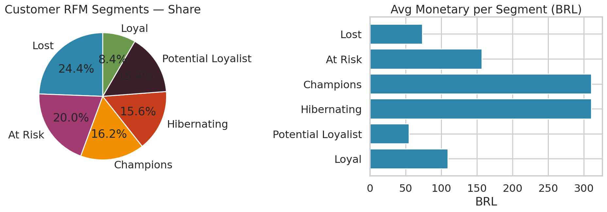
  <sub>Pure-SQL NTILE quintiles · Q14</sub>
</td>
<td align="center">
  <b>♻️ Cohort Retention Heatmap</b><br/>
  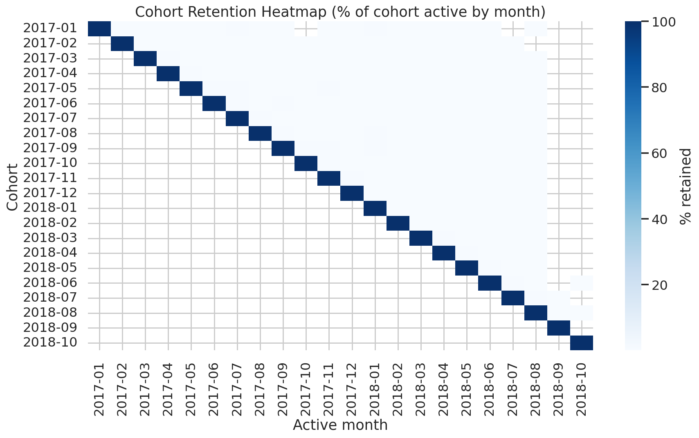
  <sub>~3 % repeat rate = huge CLV opportunity · Q18</sub>
</td>
</tr>
<tr>
<td align="center">
  <b>🚚 On-Time Delivery % by State</b><br/>
  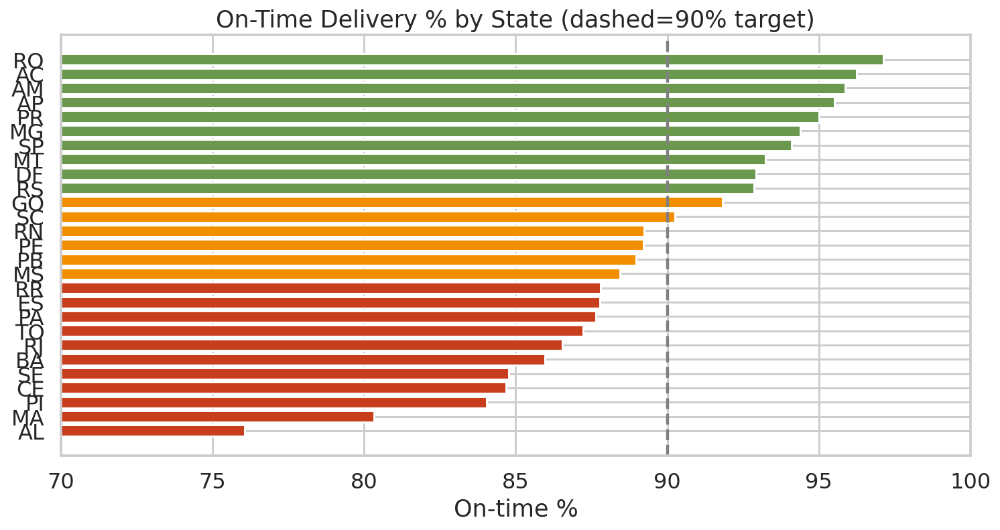
  <sub>Northern states lag SLA · Q32</sub>
</td>
<td align="center">
  <b>⭐ Late vs On-Time → Review Score</b><br/>
  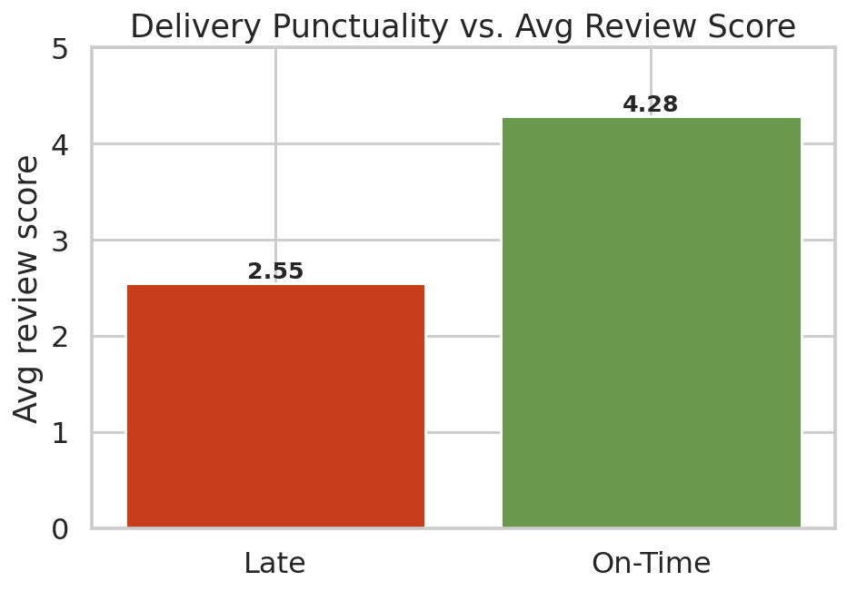
  <sub>Late orders drop reviews by 1.45 ★ · Q33</sub>
</td>
</tr>
<tr>
<td align="center">
  <b>💳 Revenue by Payment Method</b><br/>
  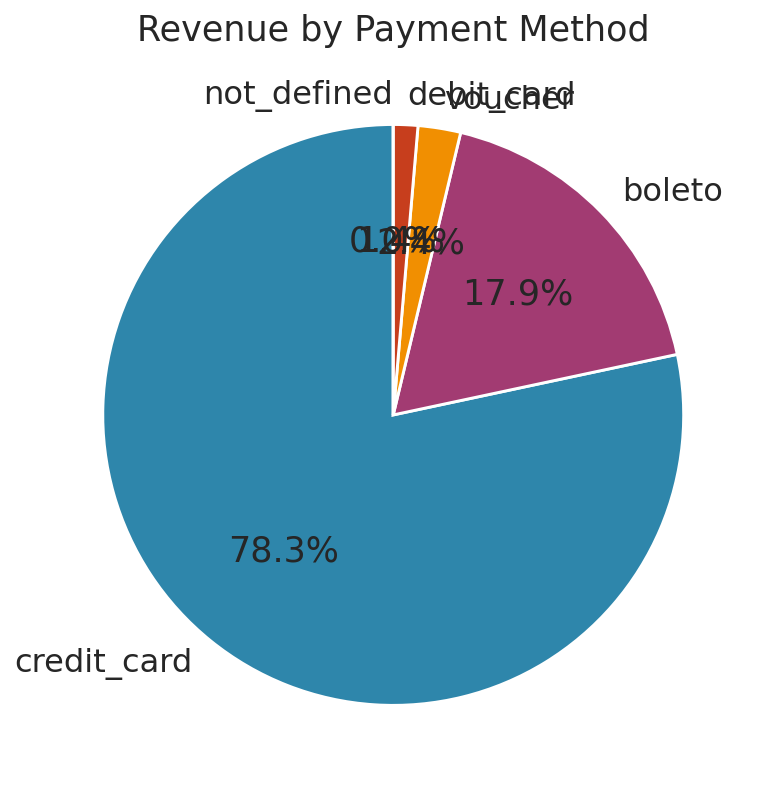
  <sub>Credit card = 78 % · Q39</sub>
</td>
<td align="center">
  <b>🧾 Credit-Card Installments</b><br/>
  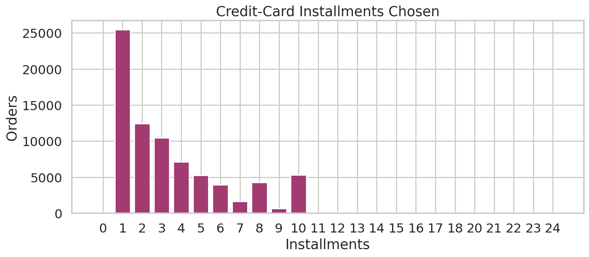
  <sub>50 % of buyers split ≥ 3 installments · Q40</sub>
</td>
</tr>
</table>

<details>
<summary>🤖 <b>Click to reveal ML model charts</b> — ROC, PR, confusion, feature importance, segments</summary>

<table>
<tr>
<td width="50%" align="center"><b>Churn — ROC Curve</b><br/>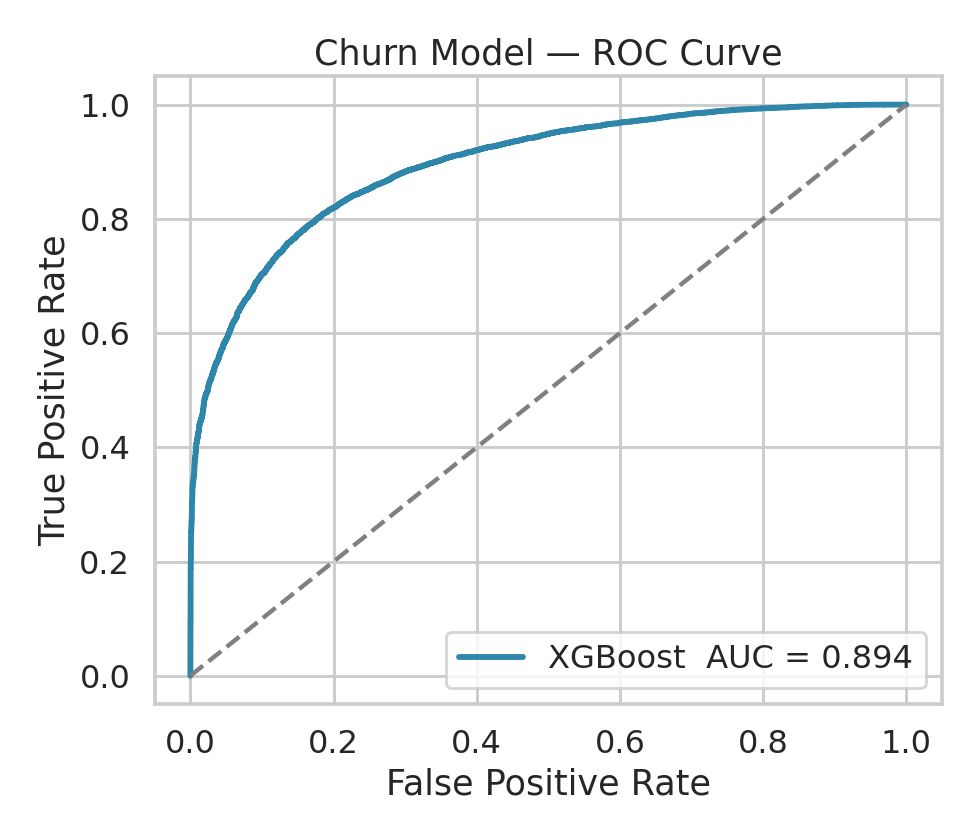</td>
<td width="50%" align="center"><b>Churn — Precision / Recall</b><br/>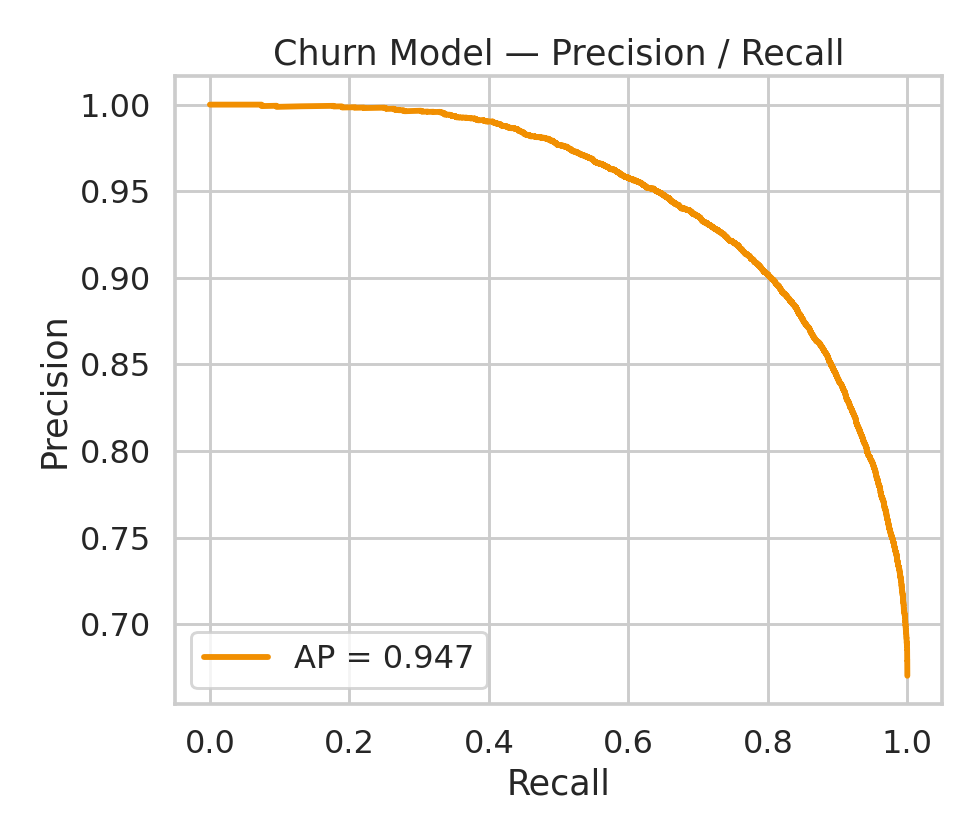</td>
</tr>
<tr>
<td align="center"><b>Churn — Confusion Matrix</b><br/>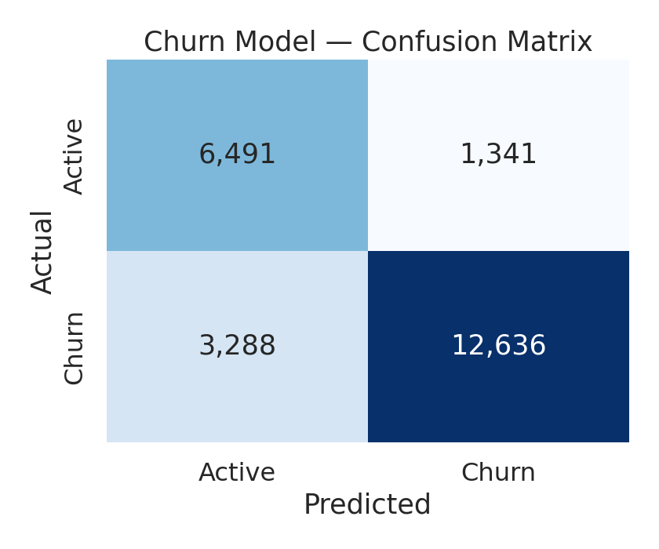</td>
<td align="center"><b>Churn — Feature Importance</b><br/>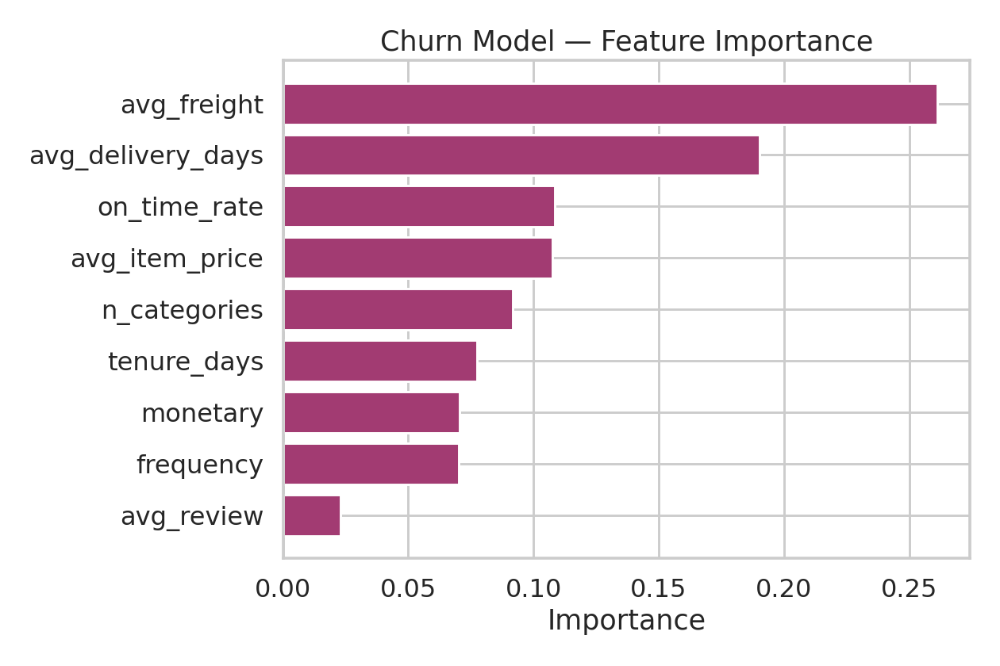</td>
</tr>
<tr>
<td align="center"><b>KMeans — Segment Scatter</b><br/>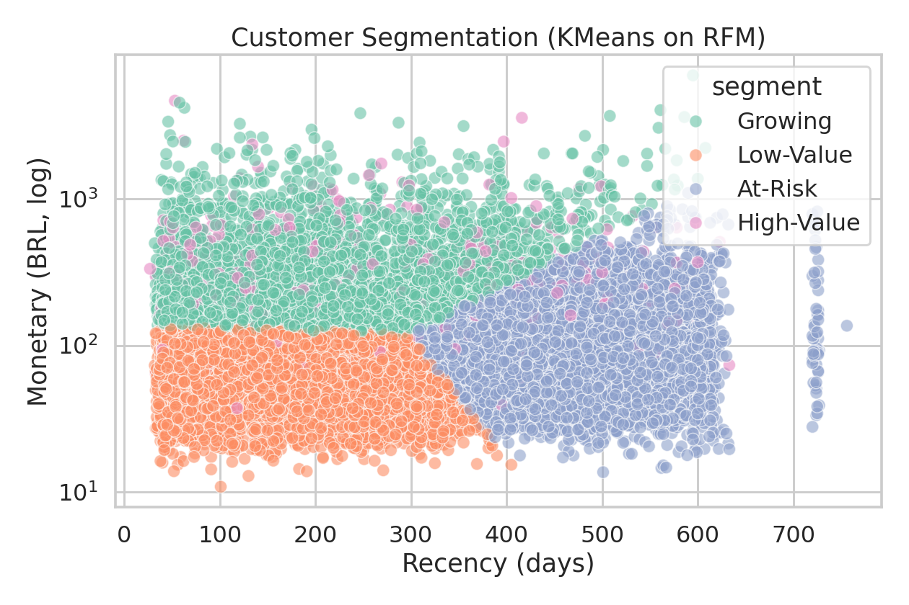</td>
<td align="center"><b>Review Regressor — Pred vs Actual</b><br/>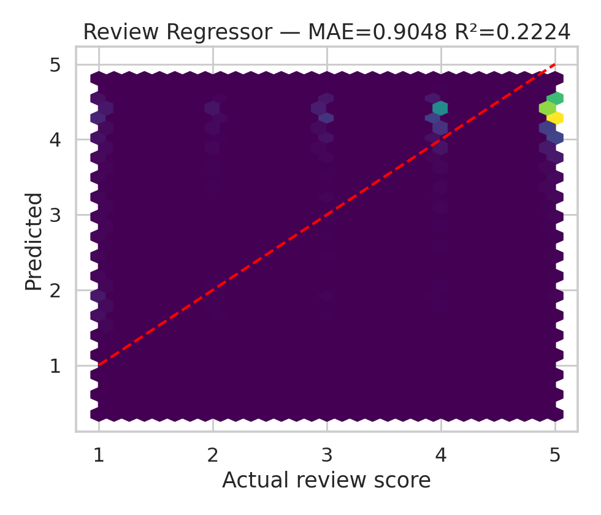</td>
</tr>
</table>

</details>

### 📄 Two dashboards ship in this repo

<table>
<tr>
<td width="33%" align="center">
  <h4>🌐 Static HTML Dashboard</h4>
  <sub>2.5 MB · self-contained · zero deps</sub>
  <br/><code>dashboard/olist_dashboard.html</code>
  <br/><sub>Just double-click to open</sub>
</td>
<td width="33%" align="center">
  <h4>⚡ Streamlit Interactive App</h4>
  <sub>9 pages · live SQL · model scoring</sub>
  <br/><code>streamlit run dashboard/app.py</code>
  <br/><sub>Runs on localhost:8501</sub>
</td>
<td width="33%" align="center">
  <h4>📋 Executive Report</h4>
  <sub>Polished narrative for stakeholders</sub>
  <br/><code>report/summary_report.html</code>
  <br/><sub>Print-ready single-pager</sub>
</td>
</tr>
</table>

---

## 🏗️ Architecture

```
                      ┌──────────────────────────────┐
                      │  Olist raw CSVs (Kaggle)     │
                      │  9 files · 1.55 M rows       │
                      └──────────────┬───────────────┘
                                     │  src/build_db.py
                                     ▼
        ┌───────────────────────────────────────────────────────┐
        │              SQLite Warehouse (olist.db)              │
        │  customers • orders • order_items • order_payments    │
        │  order_reviews • products • sellers • geolocation     │
        │  category_translation      + 12 performance indexes   │
        └────────────┬──────────────────────────┬───────────────┘
                     │                          │
                     │ 55 SQL queries           │ ML feature views (Q53–Q55)
                     ▼                          ▼
        ┌──────────────────────┐   ┌──────────────────────────────┐
        │  Analytics KPIs      │   │  ML training pipeline        │
        │  make_kpi_images.py  │   │  ml/train_models.py          │
        │  → 11 PNG charts     │   │  ├── XGBoost churn (AUC 0.89)│
        │  → kpi_headline.json │   │  ├── GBR review score        │
        └──────────┬───────────┘   │  └── KMeans RFM segments     │
                   │               └───────────┬──────────────────┘
                   │                           │  pickle artifacts
                   ▼                           ▼
         ┌────────────────────────────────────────────────────┐
         │                Presentation Layer                  │
         │  • dashboard/app.py            (Streamlit + Plotly)│
         │  • dashboard/olist_dashboard.html  (static, base64)│
         │  • report/summary_report.html       (exec report)  │
         └────────────────────────────────────────────────────┘
```

---

## 📚 Dataset

<div align="center">

### 📥 Get the data from Kaggle

[](https://www.kaggle.com/datasets/olistbr/brazilian-ecommerce)

**🔗 https://www.kaggle.com/datasets/olistbr/brazilian-ecommerce**

*Free · Kaggle account required · License: CC BY-NC-SA 4.0*

</div>

Real anonymised commercial data. Company names in review text were replaced with Game-of-Thrones house names to protect merchants — **all numbers are real**.

<table>
<thead>
<tr><th>Table</th><th align="right">Rows</th><th>Description</th></tr>
</thead>
<tbody>
<tr><td><code>customers</code></td><td align="right">99,441</td><td>customer records with unique_id, zip, city, state</td></tr>
<tr><td><code>orders</code></td><td align="right">99,441</td><td>order status + 5 timestamp fields (purchase → delivery)</td></tr>
<tr><td><code>order_items</code></td><td align="right">112,650</td><td>1..N line items per order (price, freight, seller)</td></tr>
<tr><td><code>order_payments</code></td><td align="right">103,886</td><td>payment type, installments, value</td></tr>
<tr><td><code>order_reviews</code></td><td align="right">100,000</td><td>1–5 star reviews with title & comment</td></tr>
<tr><td><code>products</code></td><td align="right">32,951</td><td>product attributes (category, dimensions, weight)</td></tr>
<tr><td><code>sellers</code></td><td align="right">3,095</td><td>seller zip / city / state</td></tr>
<tr><td><code>geolocation</code></td><td align="right"><b>1,000,163</b></td><td>zip → lat/lng lookup (drives geo analytics)</td></tr>
<tr><td><code>category_translation</code></td><td align="right">71</td><td>Portuguese → English category names</td></tr>
<tr><td><b>Total</b></td><td align="right"><b>1,551,698</b></td><td><b>across 9 normalised tables</b></td></tr>
</tbody>
</table>

---

## 🧠 SQL Analytics — 55 Queries

All queries live in [`sql/analytics_queries.sql`](sql/analytics_queries.sql), grouped into **8 business sections**. Every query has a documented business intent and **all 55 are validated against the DB via an automated smoke test**.

<table>
<thead>
<tr><th>Section</th><th align="center">Queries</th><th>Themes</th></tr>
</thead>
<tbody>
<tr><td>1 · Revenue & Growth KPIs</td><td align="center">Q01–Q10</td><td>GMV · AOV · MoM / YoY · weekday-hour heatmap · rolling 30-day MA</td></tr>
<tr><td>2 · Customer Analytics & RFM</td><td align="center">Q11–Q20</td><td>new-vs-repeat · <code>NTILE</code> RFM · cohort retention · Pareto</td></tr>
<tr><td>3 · Products & Categories</td><td align="center">Q21–Q30</td><td>top categories · price ranges · cross-sell pairs · long-tail</td></tr>
<tr><td>4 · Logistics & Delivery</td><td align="center">Q31–Q38</td><td>on-time % · late-vs-review · cross-state freight</td></tr>
<tr><td>5 · Payments & Finance</td><td align="center">Q39–Q44</td><td>payment mix · installments · split-tender · voucher usage</td></tr>
<tr><td>6 · Seller Performance</td><td align="center">Q45–Q48</td><td>top sellers · seller quintiles · 80/20 Pareto</td></tr>
<tr><td>7 · Reviews & CX</td><td align="center">Q49–Q52</td><td>score distribution · promoters vs detractors · lateness ↔ score</td></tr>
<tr><td>8 · ML Feature Views</td><td align="center">Q53–Q55</td><td>churn flag · per-customer feature matrix · exec KPI snapshot</td></tr>
</tbody>
</table>

<details>
<summary><b>👀 Click to see 3 showcase queries</b> (RFM · Root-cause · ML feature view)</summary>

<br/>

**Q14 — RFM segmentation via `NTILE` window functions (pure SQL)**

```sql
WITH agg AS (
  SELECT c.customer_unique_id,
         MAX(o.order_purchase_timestamp) AS last_order,
         COUNT(DISTINCT o.order_id)      AS frequency,
         SUM(oi.price + oi.freight_value) AS monetary
  FROM orders o
  JOIN customers   c  ON c.customer_id  = o.customer_id
  JOIN order_items oi ON oi.order_id    = o.order_id
  WHERE o.order_status NOT IN ('canceled','unavailable')
  GROUP BY c.customer_unique_id
), rfm AS (
  SELECT customer_unique_id, frequency, monetary,
         NTILE(5) OVER (ORDER BY julianday(last_order) DESC) AS R,
         NTILE(5) OVER (ORDER BY frequency DESC)             AS F,
         NTILE(5) OVER (ORDER BY monetary  DESC)             AS M
  FROM agg
)
SELECT CASE
         WHEN R<=2 AND F<=2 AND M<=2 THEN 'Champions'
         WHEN R<=2 AND F<=3           THEN 'Loyal'
         WHEN R<=2                    THEN 'Potential Loyalist'
         WHEN R= 3                    THEN 'At Risk'
         WHEN R>=4 AND F<=2           THEN 'Hibernating'
         ELSE 'Lost'
       END AS segment,
       COUNT(*)                  AS customers,
       ROUND(AVG(monetary), 2)   AS avg_monetary
FROM rfm GROUP BY segment ORDER BY customers DESC;
```

**Q52 — Delivery lateness ↔ review score (root-cause query)**

```sql
SELECT CAST(julianday(o.order_delivered_customer_date)
          - julianday(o.order_estimated_delivery_date) AS INT) AS lateness_days,
       ROUND(AVG(r.review_score), 2) AS avg_score,
       COUNT(*)                      AS n
FROM orders o
JOIN order_reviews r ON r.order_id = o.order_id
WHERE o.order_delivered_customer_date IS NOT NULL
GROUP BY lateness_days
HAVING n > 30
ORDER BY lateness_days;
```

**Q54 — Feature-engineered ML training view (feeds XGBoost)**

```sql
WITH base AS (
  SELECT c.customer_unique_id,
         COUNT(DISTINCT o.order_id)             AS frequency,
         SUM(oi.price + oi.freight_value)       AS monetary,
         AVG(oi.price)                          AS avg_item_price,
         AVG(oi.freight_value)                  AS avg_freight,
         AVG(r.review_score)                    AS avg_review,
         MAX(o.order_purchase_timestamp)        AS last_ts,
         MIN(o.order_purchase_timestamp)        AS first_ts,
         AVG(CASE WHEN o.order_delivered_customer_date <=
                       o.order_estimated_delivery_date
                  THEN 1.0 ELSE 0 END)          AS on_time_rate,
         COUNT(DISTINCT p.product_category_name) AS n_categories
  FROM orders o
  JOIN customers   c  ON c.customer_id  = o.customer_id
  JOIN order_items oi ON oi.order_id    = o.order_id
  JOIN products    p  ON p.product_id   = oi.product_id
  LEFT JOIN order_reviews r ON r.order_id = o.order_id
  GROUP BY c.customer_unique_id
)
SELECT *, CASE WHEN julianday('2018-10-01') - julianday(last_ts) > 180
               THEN 1 ELSE 0 END AS churn_flag
FROM base;
```

</details>

> ✅ **Validation:** a smoke test parses `analytics_queries.sql` into 55 blocks and executes each against `olist.db` — **55 / 55 return rows with zero errors**.

---

## 🤖 ML Model Cards

### 🟩 Model 1 — Customer Churn Classifier

<table>
<tr>
<td width="55%" valign="top">

| Attribute | Value |
|---|---|
| **Algorithm** | XGBoost (400 trees, depth 5, `hist`) |
| **Target** | `churn = 1` if no order in ≥ 180 days |
| **Class balance** | 67 % churn / 33 % active |
| **Imbalance fix** | `scale_pos_weight = neg / pos` |
| **Features (9)** | `frequency`, `monetary`, `avg_item_price`, `avg_freight`, `avg_review`, `on_time_rate`, `n_categories`, `avg_delivery_days`, `tenure_days` |
| **Split** | 71,265 train / 23,756 test · stratified · seed 42 |
| **ROC-AUC** | 🟢 **0.8945** |
| **Accuracy** | 🟢 **80.5 %** |
| **Avg-Precision** | 🟢 **0.947** |
| **Artifact** | `ml/artifacts/churn_xgb.pkl` |

**Why XGBoost?** Tabular data with mixed scales, non-linear interactions, and heavy class imbalance — XGBoost is the industry default and hits AUC 0.89 out-of-the-box with class-weight rebalancing.

</td>
<td width="45%" valign="top" align="center">
  
  <br/><br/>
  
</td>
</tr>
</table>

### 🟨 Model 2 — Review-Score Regressor

| Attribute | Value |
|---|---|
| **Algorithm** | Gradient Boosting Regressor (250 trees, depth 4) |
| **Target** | avg review score per customer (continuous 1–5) |
| **MAE** | 0.90 stars |
| **R²** | 0.22 (ceiling: target is ordinal) |
| **Business use** | Flag sellers with predicted score < 3.5 for coaching |
| **Artifact** | `ml/artifacts/review_gbr.pkl` |

### 🟦 Model 3 — RFM Customer Segmentation

| Attribute | Value |
|---|---|
| **Algorithm** | KMeans (k = 4) on log-scaled + standard-scaled RFM |
| **Segments** | **High-Value** · Growing · At-Risk · Low-Value |
| **Key insight** | **3 % of customers (High-Value) generate 24 % of GMV** |
| **Artifact** | `ml/artifacts/kmeans_rfm.pkl` (model + scaler + label map) |

> 💡 The Streamlit `🤖 ML — Churn` page includes a **live scoring form** — enter customer attributes, get a churn probability, all in-browser.

---

## 🛠️ Tech Stack

| Layer | Choice | Why |
|---|---|---|
| 🗄️ **Storage** | SQLite (+ 12 indexes) | Zero-install · portable to Postgres · handles 1.5 M rows comfortably |
| 🧮 **SQL** | ANSI + window functions | Reproducible feature engineering · works in Postgres / MySQL 8 + / BigQuery with trivial edits |
| 🐼 **Data plumbing** | pandas · numpy | Industry standard |
| 🤖 **ML** | XGBoost · scikit-learn | Best-in-class tabular ML + solid pipeline utilities |
| 📊 **Charts** | matplotlib · seaborn (PNG) + Plotly (interactive) | Static exports **and** browser interactivity |
| ⚡ **Interactive app** | Streamlit | 9 pages · `@st.cache_data` for query memoisation |
| 🌐 **Static dashboard** | Hand-rolled HTML + base64 PNGs | Runs offline · previewable in any browser or sandbox |

---

## 🔧 Run the Project

### 1️⃣ Install
```bash
git clone https://github.com/<your-username>/olist-analytics.git
cd olist-analytics
pip install -r requirements.txt
```

### 2️⃣ Get the data (~120 MB — **not** in this repo)

> ⚠️ **Why isn't the data here?** GitHub blocks files > 100 MB, and the built SQLite warehouse is 140 MB. Standard practice in DS repos: **link the dataset, ship a downloader.**

**Option A — download from Kaggle** *(official source, requires free account)*

[](https://www.kaggle.com/datasets/olistbr/brazilian-ecommerce)

1. Open → **https://www.kaggle.com/datasets/olistbr/brazilian-ecommerce**
2. Click **"Download"** (top-right) → you get `archive.zip` (~45 MB)
3. Unzip into the `data/` folder:
   ```bash
   unzip ~/Downloads/archive.zip -d data/
   ```

**Option B — one-command mirror download** *(no account needed)*
```bash
python src/download_data.py       # 9 CSVs → data/  (~5 s, 118 MB)
```

### 3️⃣ Build everything
```bash
python src/build_db.py            # 1.55 M rows → data/olist.db   (~5 s)
python ml/train_models.py         # trains 3 models               (~40 s)
python src/make_kpi_images.py     # 11 KPI charts                 (~8 s)
python src/make_html_dashboard.py # dashboard/olist_dashboard.html
python src/make_report.py         # report/summary_report.html
```

### 4️⃣ Explore

| What | How |
|---|---|
| 🌐 **Static dashboard** | Open `dashboard/olist_dashboard.html` in any browser |
| ⚡ **Interactive app** | `streamlit run dashboard/app.py` → http://localhost:8501 |
| 📋 **Executive report** | Open `report/summary_report.html` |
| 🔍 **Ad-hoc SQL** | In the Streamlit app → **`🔍 SQL Explorer`** page |

---

## 📁 Repo Layout

```text
olist_project/
├── 📄 README.md                              ← you are here
├── 📄 requirements.txt
├── 📄 .gitignore                             ← excludes data/*.csv, *.db
│
├── 📂 data/                                  ← rebuilt locally, not in git
│   ├── README.md                             ← Kaggle + mirror instructions
│   ├── olist.db                              ← SQLite warehouse (built)
│   └── *.csv                                 ← 9 raw Olist CSVs (1.55 M rows)
│
├── 📂 sql/
│   └── analytics_queries.sql                 ← 55 queries · 8 sections · 55/55 pass
│
├── 📂 ml/
│   ├── train_models.py                       ← XGBoost + GBR + KMeans pipeline
│   └── artifacts/
│       ├── churn_xgb.pkl                     ← model + feature contract
│       ├── review_gbr.pkl
│       ├── kmeans_rfm.pkl                    ← model + scaler + label map
│       └── metrics.json                      ← all reported numbers
│
├── 📂 src/
│   ├── download_data.py                      ← one-command mirror download
│   ├── build_db.py                           ← CSV → SQLite ETL + indexes
│   ├── make_kpi_images.py                    ← 11 KPI charts from live SQL
│   ├── make_html_dashboard.py                ← standalone HTML (base64 PNGs)
│   └── make_report.py                        ← executive summary_report.html
│
├── 📂 dashboard/
│   ├── app.py                                ← Streamlit — 9 pages, live SQL, model scoring
│   └── olist_dashboard.html                  ← self-contained static dashboard (2.5 MB)
│
├── 📂 images/                                ← 19 charts + banner + preview
│   ├── banner.png · dashboard_preview.png
│   ├── kpi_*.png                             ← 11 KPI charts
│   ├── churn_*.png                           ← 4 ML churn charts
│   ├── segments_*.png · review_pred.png
│   └── kpi_headline.json                     ← headline KPI cache
│
└── 📂 report/
    └── summary_report.html                   ← polished exec report (2.3 MB)
```

---

## ✅ Code Quality

<table>
<tr>
<td width="50%" valign="top">

**Architecture**
- ✅ Clear separation of `src/` · `sql/` · `ml/` · `dashboard/` · `data/` · `images/` · `report/`
- ✅ Pure-SQL feature engineering — auditable & portable to Postgres
- ✅ Data pipeline is idempotent — rerun any script safely

**Reproducibility**
- ✅ Seeded splits (`random_state=42`)
- ✅ Pickled artifacts with explicit feature contracts
- ✅ `requirements.txt` locks core versions
- ✅ Fresh clone → 4 commands → identical results

</td>
<td width="50%" valign="top">

**Documentation**
- ✅ Every SQL query has a one-line business-intent header
- ✅ Every Python module has a docstring
- ✅ In-repo `data/README.md` for the dataset landing page
- ✅ Executive report + this README + inline comments

**Validation**
- ✅ Automated smoke test — **55 / 55 SQL queries pass**
- ✅ ML metrics logged to `ml/artifacts/metrics.json`
- ✅ Type-safe I/O — `pandas.read_sql` → typed DataFrame → sklearn
- ✅ Static HTML dashboard runs with **zero external dependencies**

</td>
</tr>
</table>

---

## 📜 License & Credits

<table>
<tr>
<td width="50%" valign="top">

**License**
- 📄 **Code:** MIT — do whatever you want, attribution appreciated
- 📄 **Data:** © Olist · [CC BY-NC-SA 4.0](https://creativecommons.org/licenses/by-nc-sa/4.0/) via [Kaggle](https://www.kaggle.com/datasets/olistbr/brazilian-ecommerce)

</td>
<td width="50%" valign="top">

**Credits**
- 🇧🇷 **Olist** — [dataset publisher](https://www.kaggle.com/datasets/olistbr/brazilian-ecommerce)
- 🐍 Built with · SQLite · pandas · XGBoost · scikit-learn · Streamlit · Plotly · matplotlib · seaborn
- 📥 Mirror: [UninsubriaProjects/ecommerce_datawarehouse](https://github.com/UninsubriaProjects/ecommerce_datawarehouse)

</td>
</tr>
</table>

---

<div align="center">

### ⭐ If this project helped you, drop a star!

*A portfolio-grade demo of end-to-end SQL analytics + ML on real 1.5 M-row data.*

<br/>

**[⬆ back to top](#-olist-e-commerce-analytics--ml-platform)**

</div>
