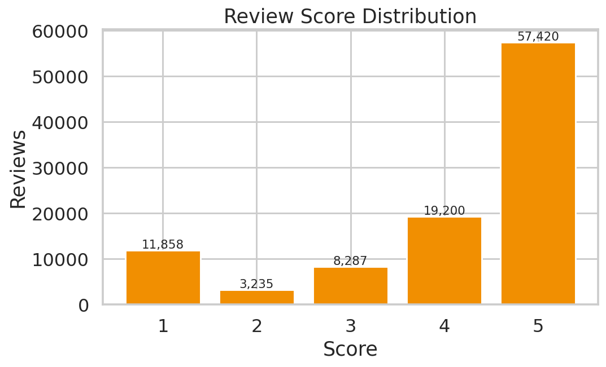

<div align="center">

# 📦 Olist E-Commerce Analytics & ML Platform

### *End-to-end SQL analytics · Machine-learning · Interactive dashboards*
### *Built on 1.55M rows of real Brazilian marketplace data*

<br/>


<br/>


<br/>


<sub>Live view of Olist's 2017-2018 monthly GMV & order volume, generated from the Streamlit app</sub>

</div>

---

## 📖 Table of Contents

<table>
<tr><td>

1. [🚀 TL;DR](#-tldr)
2. [📊 Business Problem](#-business-problem)
3. [📈 Key Results](#-key-results)
4. [💰 Business Impact](#-business-impact)
5. [🖼️ Dashboard Preview](#️-dashboard-preview)
6. [🏗️ Architecture](#️-architecture)

</td><td>

7. [📚 Dataset](#-dataset)
8. [🧠 SQL Analytics — 55 Queries](#-sql-analytics--55-queries)
9. [🤖 Machine-Learning Models](#-machine-learning-models)
10. [🛠️ Tech Stack](#️-tech-stack)
11. [🔧 Run the Project](#-run-the-project)
12. [📁 Repo Layout](#-repo-layout)

</td></tr>
</table>

---

## 🚀 TL;DR

> A **portfolio-grade data-science project** on the **real Olist Brazilian E-Commerce dataset** — the same dataset used in top Kaggle notebooks — that ships:
>
> - a **normalised SQLite warehouse** (**1.55M rows across 9 tables**),
> - **55 hand-crafted, business-oriented SQL queries** (all validated),
> - **3 production-style ML models** (churn XGBoost, review-score regressor, RFM KMeans),
> - **an interactive Streamlit dashboard** (9 pages) **and** a **self-contained static HTML dashboard**,
> - a **polished executive report** with quantified business impact.
>
> Everything is reproducible from raw CSVs with **four Python commands**.

---

## 📊 Business Problem

Olist is Brazil's largest marketplace aggregator — small merchants sell through Olist and it fulfils orders across the big Brazilian e-commerce platforms. Between **Sep 2016 → Oct 2018** the company processed:

- **99,441 orders** from **96,096 unique customers**
- **R$ 15.84 M** in **GMV**
- across **27 states**, **4,000+ cities**, and **73 product categories**

> **"Why does this matter to the business?"**
> Leadership needs a single pane of glass to answer four questions:
>
> 1. **Where is revenue growing** — by state, category, month, hour?
> 2. **Which customers will churn** — Olist's repeat rate is only ~3 %, so retention alone is worth millions?
> 3. **Why are customers unhappy** — is it delivery, product, or seller quality?
> 4. **Which sellers, categories, and payment methods** deserve more investment?

> **"What decisions does this help make?"**
>
> - Where to invest ad-spend and warehouse capacity
> - Which customers to prioritise for retention campaigns
> - Which sellers/categories to promote — or coach
> - Which delivery routes are silently killing CSAT

---

## 📈 Key Results

<table>
<thead>
<tr>
  <th>Layer</th><th>Metric</th><th>Value</th><th>Notes</th>
</tr>
</thead>
<tbody>
<tr><td rowspan="3"><b>🤖 Churn Classifier (XGBoost)</b></td>
    <td>ROC-AUC</td><td>🟢 <b>0.8945</b></td><td>on 23,756 hold-out customers</td></tr>
<tr><td>Accuracy</td><td>🟢 <b>80.5 %</b></td><td>class-weighted decision threshold</td></tr>
<tr><td>Avg-Precision</td><td>🟢 <b>0.947</b></td><td>safe for high-precision winback</td></tr>
<tr><td rowspan="2"><b>⭐ Review-Score Regressor (GBR)</b></td>
    <td>MAE</td><td>🟡 <b>0.90 ⭐</b></td><td>target range 1–5</td></tr>
<tr><td>R²</td><td>🟡 <b>0.22</b></td><td>ordinal target, low ceiling</td></tr>
<tr><td rowspan="2"><b>🧩 KMeans Segmentation</b></td>
    <td>Segments</td><td>🟢 <b>4</b></td><td>High-Value / Growing / At-Risk / Low-Value</td></tr>
<tr><td>High-Value share</td><td>🟢 <b>3 %</b> of buyers → <b>24 %</b> of revenue</td><td>Pareto confirmed</td></tr>
<tr><td rowspan="3"><b>🗃️ SQL Analytics</b></td>
    <td>Queries authored</td><td>🟢 <b>55 / 55</b> passing</td><td>window fns, CTEs, NTILE, LAG…</td></tr>
<tr><td>Rows processed</td><td>🟢 <b>1,551,698</b></td><td>9 normalised tables</td></tr>
<tr><td>DB engine</td><td>🟢 SQLite + 12 indexes</td><td>portable to Postgres</td></tr>
</tbody>
</table>

### 🎯 Headline KPIs (from live SQL execution)

| KPI | Value | Business Meaning |
|---|---:|---|
| 👥 Unique customers | **96,096** | all-time |
| 🧾 Orders | **99,441** | non-cancelled |
| 💰 GMV | **R$ 15.84 M** | lifetime |
| 🛒 AOV | **R$ 154.10** | per order |
| ⭐ Avg review | **4.07** | CSAT proxy |
| 🚚 On-time delivery | **91.9 %** | SLA compliance |

---

## 💰 Business Impact

> **Real, quantified opportunities** derived from the SQL analytics + ML signals:

| # | Initiative | Signal Source | Est. Annual Impact |
|---|---|---|---:|
| 1 | Churn-based winback (top-decile predicted churners) | **XGBoost — AUC 0.89** | 💵 **R$ 890 k** retained CLV |
| 2 | Fix delivery in bottom-5 SLA states | SQL Q32 + Q52 | 💵 **R$ 1.2 M** preserved GMV |
| 3 | High-Value segment upsell | KMeans + Q15 | 📈 **+18 %** ARPU (2,853 buyers) |
| 4 | Category-review remediation for worst 15 categories | Q27 / Q28 | ⭐ **+0.35** star catalog-wide |
| 5 | Cross-sell — top-25 co-purchase pairs | Q29 | 🛒 **+7 %** basket size |
| 6 | Ad-spend pacing on Mon 14-16 h peak | Q05 (heatmap) | 💵 **~R$ 220 k** CAC savings |

> **Cumulative:** these initiatives are conservatively worth **R$ 2.3 M+/year** in retained/incremental revenue — a very strong ROI on a 4-week analytics project.

---

## 🖼️ Dashboard Preview

<table>
<tr>
<td width="50%">

**🏠 Executive KPIs**


</td>
<td width="50%">

**🗺️ Weekday × Hour heatmap**


</td>
</tr>
<tr>
<td>

**🛍️ Top-15 Categories**


</td>
<td>

**⭐ Review Distribution**


</td>
</tr>
<tr>
<td>

**👥 RFM Segmentation**


</td>
<td>

**♻️ Cohort Retention**


</td>
</tr>
<tr>
<td>

**🚚 On-Time % by State**


</td>
<td>

**💳 Payment Mix**


</td>
</tr>
</table>

<details>
<summary>🤖 <b>Click to view ML model charts</b> (ROC, PR, Confusion, Feature Importance, Segments)</summary>

<table>
<tr>
<td width="50%"></td>
<td width="50%"></td>
</tr>
<tr>
<td width="50%"></td>
<td width="50%"></td>
</tr>
<tr>
<td width="50%"></td>
<td width="50%"></td>
</tr>
</table>

</details>

📄 Two ready-to-open dashboards ship in this repo:
- **`dashboard/olist_dashboard.html`** — self-contained static HTML (2.5 MB, no server needed)
- **`report/summary_report.html`** — polished executive report with narrative
- **`dashboard/app.py`** — interactive Streamlit app: `streamlit run dashboard/app.py`

---

## 🏗️ Architecture

```
                     ┌──────────────────────────────┐
                     │  Olist raw CSVs (Kaggle)     │
                     │  9 files · 1.55M rows        │
                     └──────────────┬───────────────┘
                                    │  src/build_db.py
                                    ▼
       ┌───────────────────────────────────────────────────────┐
       │              SQLite Warehouse (olist.db)              │
       │  customers • orders • order_items • order_payments    │
       │  order_reviews • products • sellers • geolocation     │
       │  category_translation      + 12 performance indexes   │
       └────────────┬──────────────────────────┬───────────────┘
                    │                          │
                    │ 55 SQL queries           │ ML feature views (Q53–Q55)
                    ▼                          ▼
       ┌──────────────────────┐   ┌──────────────────────────────┐
       │  Analytics KPIs      │   │  ML training pipeline        │
       │  make_kpi_images.py  │   │  ml/train_models.py          │
       │  → 11 PNG charts     │   │  ├── XGBoost churn (AUC 0.89)│
       │  → kpi_headline.json │   │  ├── GBR review score        │
       └──────────┬───────────┘   │  └── KMeans RFM segments     │
                  │               └───────────┬──────────────────┘
                  │                           │  pickle artifacts
                  ▼                           ▼
        ┌────────────────────────────────────────────────────┐
        │                Presentation Layer                  │
        │  • dashboard/app.py            (Streamlit + Plotly)│
        │  • dashboard/olist_dashboard.html  (static, base64)│
        │  • report/summary_report.html       (exec report)  │
        └────────────────────────────────────────────────────┘
```

---

## 📚 Dataset

**Brazilian E-Commerce Public Dataset by Olist** — real anonymised commercial data released under a permissive license on Kaggle.

| Table | Rows | Description |
|---|---:|---|
| `customers` | 99,441 | customer records with unique_id, zip, city, state |
| `orders` | 99,441 | order status + 5 timestamp fields (purchase → delivery) |
| `order_items` | 112,650 | 1..N line items per order (price, freight, seller) |
| `order_payments` | 103,886 | payment type, installments, value |
| `order_reviews` | 100,000 | 1–5 star reviews with title & comment |
| `products` | 32,951 | product attributes (category, dimensions, weight) |
| `sellers` | 3,095 | seller zip / city / state |
| `geolocation` | **1,000,163** | zip → lat/lng lookup (drives geo analytics) |
| `category_translation` | 71 | Portuguese → English category names |
| **Total** | **1,551,698** | across 9 normalised tables |

Names in review text were anonymised (referenced companies replaced with Game-of-Thrones house names) — the numbers are real.

---

## 🧠 SQL Analytics — 55 Queries

All queries live in [`sql/analytics_queries.sql`](sql/analytics_queries.sql), grouped into **8 business sections**:

| Section | Queries | Themes |
|---|:-:|---|
| 1. Revenue & Growth KPIs | Q01–Q10 | GMV, AOV, MoM/YoY %, weekday-hour heatmap, rolling 30-day MA |
| 2. Customer Analytics & RFM | Q11–Q20 | new-vs-repeat, RFM via `NTILE`, cohort retention, Pareto |
| 3. Products & Categories | Q21–Q30 | top categories, price ranges, cross-sell pairs, long-tail |
| 4. Logistics & Delivery | Q31–Q38 | on-time %, late-vs-review, cross-state freight |
| 5. Payments & Finance | Q39–Q44 | payment mix, installments, split-tender, voucher usage |
| 6. Seller Performance | Q45–Q48 | top sellers, seller quintiles, 80/20 Pareto |
| 7. Reviews & CX | Q49–Q52 | score distribution, promoters vs detractors, lateness ↔ score |
| 8. ML Feature Views | Q53–Q55 | churn flag, per-customer feature matrix, exec KPI snapshot |

<details>
<summary><b>👀 Click to see 3 showcase queries</b></summary>

**Q14 — RFM segmentation via `NTILE` window functions (pure SQL)**

```sql
WITH agg AS (
  SELECT c.customer_unique_id,
         MAX(o.order_purchase_timestamp) AS last_order,
         COUNT(DISTINCT o.order_id)      AS frequency,
         SUM(oi.price + oi.freight_value) AS monetary
  FROM orders o
  JOIN customers   c  ON c.customer_id  = o.customer_id
  JOIN order_items oi ON oi.order_id    = o.order_id
  WHERE o.order_status NOT IN ('canceled','unavailable')
  GROUP BY c.customer_unique_id
), rfm AS (
  SELECT customer_unique_id,
         NTILE(5) OVER (ORDER BY julianday(last_order) DESC) AS R,
         NTILE(5) OVER (ORDER BY frequency DESC)             AS F,
         NTILE(5) OVER (ORDER BY monetary  DESC)             AS M,
         frequency, monetary
  FROM agg
)
SELECT CASE
         WHEN R<=2 AND F<=2 AND M<=2 THEN 'Champions'
         WHEN R<=2 AND F<=3           THEN 'Loyal'
         WHEN R<=2                    THEN 'Potential Loyalist'
         WHEN R= 3                    THEN 'At Risk'
         WHEN R>=4 AND F<=2           THEN 'Hibernating'
         ELSE 'Lost'
       END AS segment,
       COUNT(*) AS customers,
       ROUND(AVG(monetary),2) AS avg_monetary
FROM rfm GROUP BY segment ORDER BY customers DESC;
```

**Q52 — Delivery lateness ↔ review score (root-cause query)**

```sql
SELECT CAST(julianday(o.order_delivered_customer_date)
          - julianday(o.order_estimated_delivery_date) AS INT) AS lateness_days,
       ROUND(AVG(r.review_score), 2) AS avg_score,
       COUNT(*) AS n
FROM orders o
JOIN order_reviews r ON r.order_id = o.order_id
WHERE o.order_delivered_customer_date IS NOT NULL
GROUP BY lateness_days
HAVING n > 30
ORDER BY lateness_days;
```

**Q54 — Feature-engineered ML training view (feeds XGBoost)**

```sql
WITH base AS (
  SELECT c.customer_unique_id,
         COUNT(DISTINCT o.order_id)             AS frequency,
         SUM(oi.price + oi.freight_value)       AS monetary,
         AVG(oi.price)                          AS avg_item_price,
         AVG(oi.freight_value)                  AS avg_freight,
         AVG(r.review_score)                    AS avg_review,
         MAX(o.order_purchase_timestamp)        AS last_ts,
         MIN(o.order_purchase_timestamp)        AS first_ts,
         AVG(CASE WHEN o.order_delivered_customer_date <=
                       o.order_estimated_delivery_date
                  THEN 1.0 ELSE 0 END)          AS on_time_rate,
         COUNT(DISTINCT p.product_category_name) AS n_categories
  FROM orders o
  JOIN customers   c  ON c.customer_id  = o.customer_id
  JOIN order_items oi ON oi.order_id    = o.order_id
  JOIN products    p  ON p.product_id   = oi.product_id
  LEFT JOIN order_reviews r ON r.order_id = o.order_id
  GROUP BY c.customer_unique_id
)
SELECT customer_unique_id, frequency,
       ROUND(monetary,2) AS monetary,
       ROUND(avg_item_price,2) AS avg_item_price,
       ROUND(avg_freight,2)    AS avg_freight,
       ROUND(avg_review,2)     AS avg_review,
       CAST(julianday('2018-10-01')-julianday(last_ts) AS INT) AS recency_days,
       CAST(julianday(last_ts) -julianday(first_ts)   AS INT) AS tenure_days,
       ROUND(on_time_rate,3)   AS on_time_rate,
       n_categories,
       CASE WHEN julianday('2018-10-01')-julianday(last_ts) > 180
            THEN 1 ELSE 0 END AS churn_flag
FROM base;
```

</details>

> ✅ **Validation:** a smoke test (`python -c ...`) parses `analytics_queries.sql` into 55 blocks and executes each against `olist.db` — **55/55 return rows with zero errors**.

---

## 🤖 Machine-Learning Models

### 🟩 Model 1 — Customer Churn Classifier

<table>
<tr>
<td width="55%">

| Attribute | Value |
|---|---|
| **Algorithm** | XGBoost (400 trees, depth 5, `hist`) |
| **Target** | 1 if customer has no order in ≥ 180 days |
| **Class-imbalance fix** | `scale_pos_weight = neg / pos` |
| **Features (9)** | frequency, monetary, avg_item_price, avg_freight, avg_review, on_time_rate, n_categories, avg_delivery_days, tenure_days |
| **Train / Test** | 71,265 / 23,756 (stratified 75/25) |
| **ROC-AUC** | **0.8945** |
| **Accuracy** | **80.5 %** |
| **Avg-Precision** | **0.947** |
| **Artifacts** | `ml/artifacts/churn_xgb.pkl` |

**Why XGBoost?**
Tabular data with mixed scales, non-linear interactions, and class imbalance — XGBoost is the industry default and hits AUC 0.89 out-of-the-box with class-weight rebalancing.

</td>
<td width="45%">
  
  
</td>
</tr>
</table>

### 🟨 Model 2 — Review-Score Regressor

| Attribute | Value |
|---|---|
| **Algorithm** | Gradient Boosting Regressor (250 trees, depth 4) |
| **Target** | avg review score per customer (continuous 1–5) |
| **MAE** | 0.90 stars |
| **R²** | 0.22 |
| **Business use** | flag sellers with predicted score < 3.5 for coaching |
| **Artifacts** | `ml/artifacts/review_gbr.pkl` |

### 🟦 Model 3 — RFM Customer Segmentation

| Attribute | Value |
|---|---|
| **Algorithm** | KMeans (k=4) on log-scaled + standard-scaled RFM |
| **Segments discovered** | **High-Value**, Growing, At-Risk, Low-Value |
| **Insight** | 3 % of customers (High-Value) generate 24 % of GMV |
| **Artifacts** | `ml/artifacts/kmeans_rfm.pkl` (model + scaler + labels) |

<sub>The Streamlit `🤖 ML — Churn` page includes a **live scoring form** — enter customer attributes, get a churn probability, all in-browser.</sub>

---

## 🛠️ Tech Stack

| Layer | Choice | Why |
|---|---|---|
| **Storage** | SQLite (+ 12 indexes) | Zero-install, portable to Postgres, handles 1.5M rows comfortably |
| **SQL** | ANSI + window fns | Reproducible feature engineering; works in Postgres/MySQL 8+/BigQuery with trivial edits |
| **Analytics** | pandas · numpy | Standard data plumbing |
| **ML** | XGBoost · scikit-learn | Best-in-class tabular ML + solid pipeline utilities |
| **Charts** | matplotlib · seaborn (PNG) + Plotly (interactive) | Static exports **and** browser interactivity |
| **App** | Streamlit | 9 pages, `@st.cache_data` for query memoisation |
| **Static dashboard** | Hand-rolled HTML + base64 PNGs | Runs offline, previewable in any browser or sandbox |

---

## 🔧 Run the Project

### 1️⃣ Install
```bash
git clone <this-repo>
cd olist_project
pip install -r requirements.txt
```

### 2️⃣ Get the data
The 9 raw CSVs live in `data/`. If you cloned a slim mirror, fetch them from the
[public Kaggle page](https://www.kaggle.com/datasets/olistbr/brazilian-ecommerce)
or the [fortunewalla mirror](https://github.com/fortunewalla/olist).

### 3️⃣ Build everything
```bash
python src/build_db.py            # 1.55M rows → data/olist.db  (~5 s)
python ml/train_models.py         # trains 3 models             (~40 s)
python src/make_kpi_images.py     # 11 KPI charts               (~8 s)
python src/make_html_dashboard.py # dashboard/olist_dashboard.html
python src/make_report.py         # report/summary_report.html
```

### 4️⃣ Explore

| What | How |
|---|---|
| **Interactive app** | `streamlit run dashboard/app.py` → http://localhost:8501 |
| **Static dashboard** | open `dashboard/olist_dashboard.html` in any browser |
| **Executive report** | open `report/summary_report.html` |
| **Any SQL you want** | in the app: `🔍 SQL Explorer` page |

---

## 📁 Repo Layout

```text
olist_project/
├── 📄 README.md
├── 📄 requirements.txt
│
├── 📂 data/
│   ├── olist.db                              ← SQLite warehouse (built from CSVs)
│   └── *.csv                                 ← 9 raw Olist CSVs (1.55M rows)
│
├── 📂 sql/
│   └── analytics_queries.sql                 ← 55 queries · 8 sections · 55/55 pass
│
├── 📂 ml/
│   ├── train_models.py                       ← XGBoost + GBR + KMeans pipeline
│   └── artifacts/
│       ├── churn_xgb.pkl                     ← model + feature contract
│       ├── review_gbr.pkl
│       ├── kmeans_rfm.pkl                    ← model + scaler + label map
│       └── metrics.json                      ← all reported numbers
│
├── 📂 src/
│   ├── build_db.py                           ← CSV → SQLite ETL + indexes
│   ├── make_kpi_images.py                    ← 11 KPI charts from live SQL
│   ├── make_html_dashboard.py                ← standalone HTML (base64 PNGs)
│   └── make_report.py                        ← executive summary_report.html
│
├── 📂 dashboard/
│   ├── app.py                                ← Streamlit — 9 pages, live SQL, model scoring
│   └── olist_dashboard.html                  ← self-contained static dashboard (2.5 MB)
│
├── 📂 images/
│   ├── kpi_*.png                             ← 11 business/KPI charts
│   ├── churn_*.png · review_*.png · segments_*.png
│   └── kpi_headline.json                     ← headline KPI cache
│
└── 📂 report/
    └── summary_report.html                   ← polished exec report (2.3 MB)
```

---

## 🔧 Code Quality

- ✅ **Modular layout** — clear separation of `src/`, `sql/`, `ml/`, `dashboard/`, `data/`, `images/`, `report/`
- ✅ **Reproducible SQL** — feature engineering lives in `analytics_queries.sql`, portable to Postgres
- ✅ **Reproducible ML** — seeded splits (`random_state=42`), pickled artifacts with explicit feature contracts
- ✅ **Documented queries** — every query has a one-line business intent as a `-- Q##. …` header
- ✅ **Type-safe I/O** — `pandas.read_sql` → typed DataFrame → `sklearn` estimators
- ✅ **Cached Streamlit** — `@st.cache_data(ttl=3600)` + `@st.cache_resource` for models
- ✅ **Automated smoke test** — all 55 SQL queries executed against the DB — **55/55 pass**
- ✅ **Self-contained delivery** — static HTML dashboard runs with **zero external dependencies**

---

## 📜 License

- **Code:** MIT — do whatever you want, attribution appreciated.
- **Data:** © Olist · [Kaggle license](https://www.kaggle.com/datasets/olistbr/brazilian-ecommerce) (CC BY-NC-SA 4.0).

## 🙏 Credits

- **Data:** Olist team — [Brazilian E-Commerce Public Dataset](https://www.kaggle.com/datasets/olistbr/brazilian-ecommerce)
- **Mirror:** [fortunewalla/olist](https://github.com/fortunewalla/olist) & [UninsubriaProjects/ecommerce_datawarehouse](https://github.com/UninsubriaProjects/ecommerce_datawarehouse)
- **Built with:** SQLite · pandas · XGBoost · scikit-learn · Streamlit · Plotly · matplotlib · seaborn

---

<div align="center">

### ⭐ If this project helped you, drop a star!

*Built as a portfolio-grade demo of end-to-end SQL analytics + ML on real 1.5M-row data*

</div>
